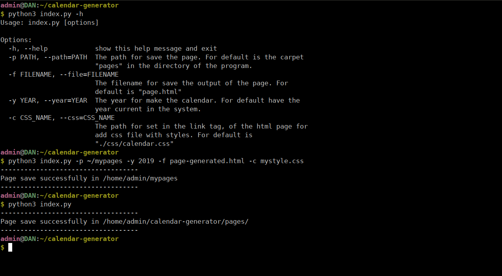
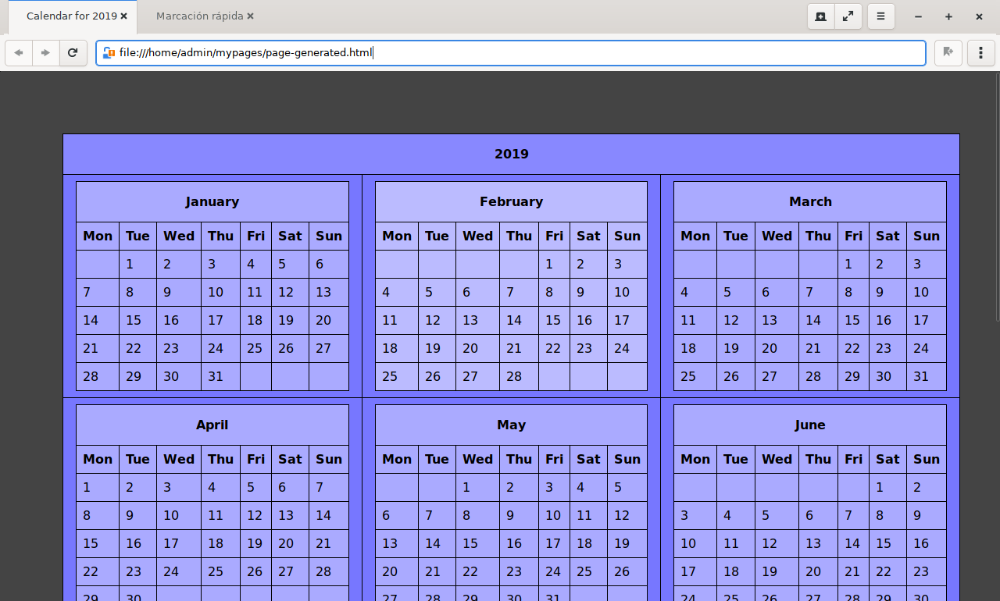

# Calendar Generator.

**This is a terminal application for generate calendar, in html pages. Made with python.**

**This program not require dependencies. Only python3 installed.**

## Installation.

```bash
git clone https://github.com/EduardYan/calendar-generator.git
cd calendar-generator/
```

## Run.

We must pass diferents options for execute:



### Values for default to generate calendar.

- The path for save the pages created for default is the carpet pages in the repository.

- The filename for the page is for default "page.html"

- The year for default is the year current in the system.

- The css link for default is this:

  ```html
  <link rel="stylesheet" href="./css/calendar.css" />
  ```

## Screenshot.



## Errors or Bugs.

<a href="mailto:eduarygp@gmail.com" target="_blank">Contact Me</a>
